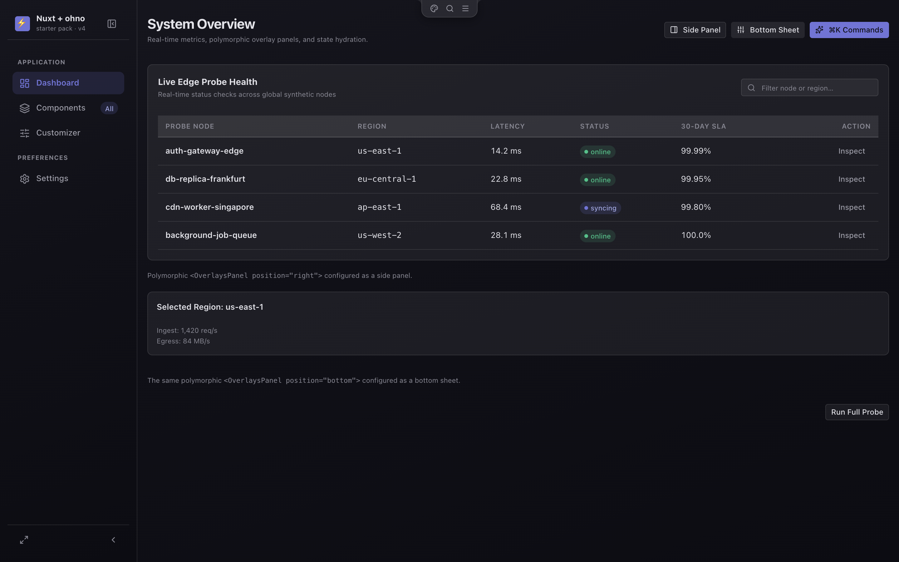
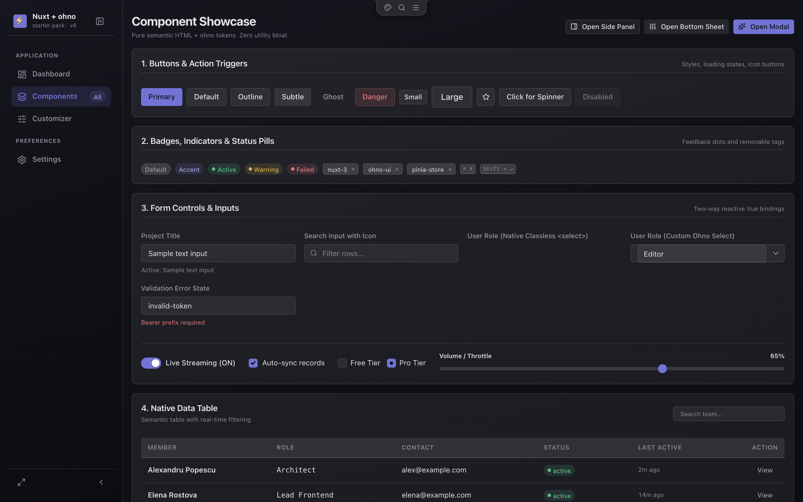
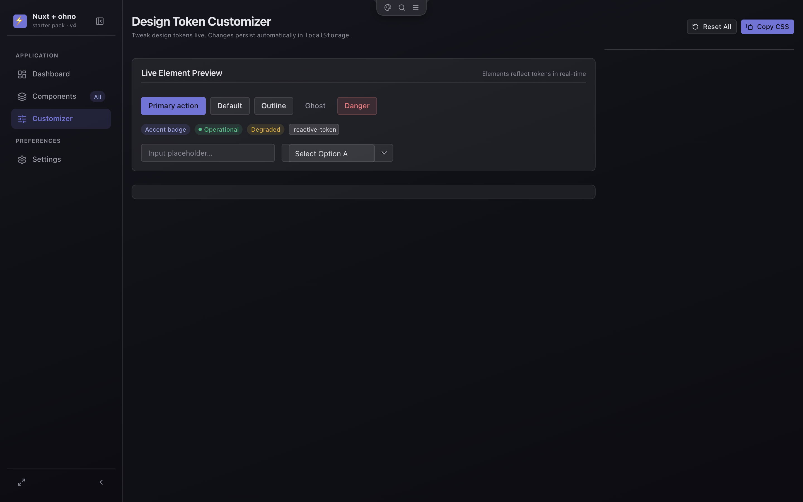
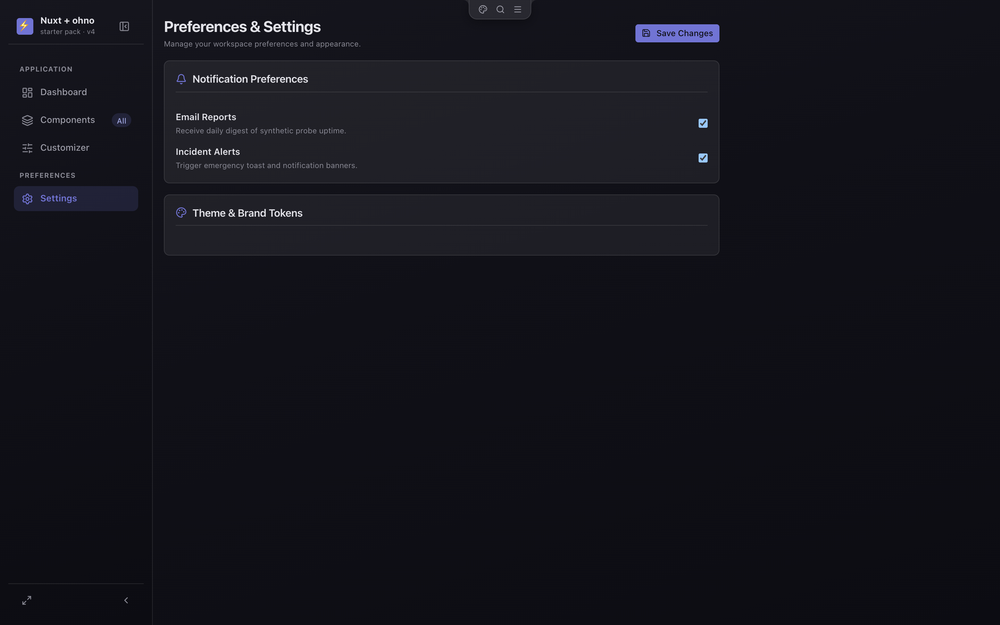
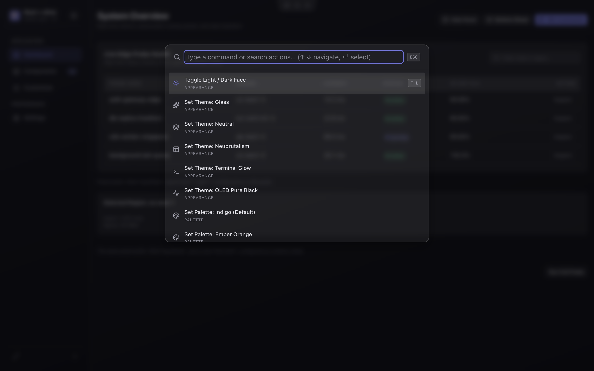

# Nuxt 3 · ohno Ultra-Minimal Starter Pack

> **A zero-config-clutter, classless-first Nuxt 3 starter template powered by the ohno design system, Pinia reactive state, Lucide icons, a Raycast-style ⌘K command palette, and an authentic hardware notch.**

---

## 📸 Screenshots

<div align="center">

| Dashboard | Components |
|:---:|:---:|
|  |  |

| Token Customizer | Settings |
|:---:|:---:|
|  |  |

| ⌘K Command Palette |
|:---:|
|  |

</div>

---

## ⚡ Key Highlights

- **Pure Semantic & Classless Styling:** Plain HTML (`<button>`, `<table>`, `<input>`, `<select>`, `<details>`) looks finished out of the box with zero Tailwind utility bloat.
- **Hardware Notch (`<AppNotch>`):** Flush top-bezel notch with 3 compact icon buttons (`🎨 Theme`, `🔍 ⌘K`, `☰ Menu`), inverted corner radii, and zero duplicate bars.
- **Raycast ⌘K Command Palette (`<CommandPalette>`):** Keyboard-driven action launcher with category grouping and shortcuts.
- **Polymorphic Overlay Panel (`<AppPanel>`):** Unified slide-over drawer, bottom sheet, and modal in a single flexible component.
- **Zero-DOM Native Toasts (`useToast()`):** Directly calls `OHNO.toast()` under the hood with zero template boilerplate or custom toast containers.
- **Full Form Controls:** Classless native `<select>` with custom chevron, `<AppSelect>` search dropdown, iOS switch toggles, custom checkboxes, radio groups, and range sliders.
- **Multi-Dimensional Theming:** 5 structural themes (`neutral`, `glass`, `neu`, `term`, `oled`) + 2 faces (`dark`, `light`) + 4 palettes (`indigo`, `ember`, `forest`, `mono`) with `color-mix()` chroma scaling.
- **Zero Config Clutter:** Single `tsconfig.json`, zero dotfile sprawl, native `bun` runtime.

---

## 🚀 Quickstart

```bash
# Global alias — works from ANY directory (scaffolds into $PWD/my-new-app):
nux-scaffold my-new-app --appkit
cd my-new-app/ohnuxt

# Or, if already in the starter directory:
bun install

# Start development server
bun run dev

# Generate static production build
bun run generate
```

---

## 📁 Flat Component Architecture

```text
├── llms.txt              # Complete machine contract for all ohno tokens & classes
├── assets/css/
│   ├── tokens.css        # Core design tokens (--o-*)
│   ├── base.css          # Semantic element defaults (@layer base)
│   ├── components.css    # Components (@layer components)
│   └── customizer.css    # Customizer styles
├── components/
│   ├── AppNotch.vue          # Top-bezel 3-icon hardware notch
│   ├── AppModal.vue          # Accessible <dialog> wrapper
│   ├── AppPanel.vue          # Polymorphic drawer/sheet
│   ├── AppSelect.vue         # Custom searchable dropdown
│   ├── CommandPalette.vue    # Raycast ⌘K overlay
│   ├── ThemeCustomizer.vue   # Token & appearance customizer
│   ├── TokenSlider.vue       # Range slider control
│   ├── ColorPicker.vue       # Hex color picker grid
│   └── CodeBlock.vue         # Code snippet box with copy
├── layouts/
│   └── default.vue           # Collapsible dual-control sidebar + viewport
├── pages/
│   ├── index.vue             # System Overview & KPI metrics dashboard
│   ├── components.vue        # Interactive UI gallery & form showcase
│   ├── customizer.vue        # Dedicated token customizer page
│   └── settings.vue          # Workspace preferences
├── composables/
│   └── useToast.ts           # Zero-DOM wrapper for OHNO.toast()
├── stores/
│   └── theme.ts              # Persistent design tokens & appearance
└── app.vue                   # Reactive useHead & layout root
```

---

## 🎨 Component Usage Patterns

### 1. Polymorphic Overlay Panel
```vue
<AppPanel
  v-model="isOpen"
  title="Resource Inspector"
  position="right"
  width="420px"
>
  <p>Panel content goes here.</p>
  <template #footer="{ close }">
    <button class="btn btn-primary btn-sm" @click="close">Done</button>
  </template>
</AppPanel>
```

### 2. Native & Custom Selects
```vue
<!-- Pure Classless Native Select -->
<select v-model="role">
  <option value="admin">Administrator</option>
  <option value="editor">Editor</option>
</select>

<!-- Custom Searchable Dropdown -->
<AppSelect
  v-model="role"
  :options="['Administrator', 'Editor', 'Viewer']"
  searchable
/>
```

### 3. Native Toasts
```vue
<script setup lang="ts">
const toast = useToast()

function notify() {
  toast.success('Action completed successfully!')
}
</script>
```

---

## 🛠️ CLI Scaffolder

```bash
create-clean-nuxt my-new-app
```
